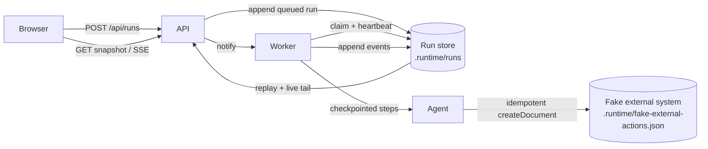
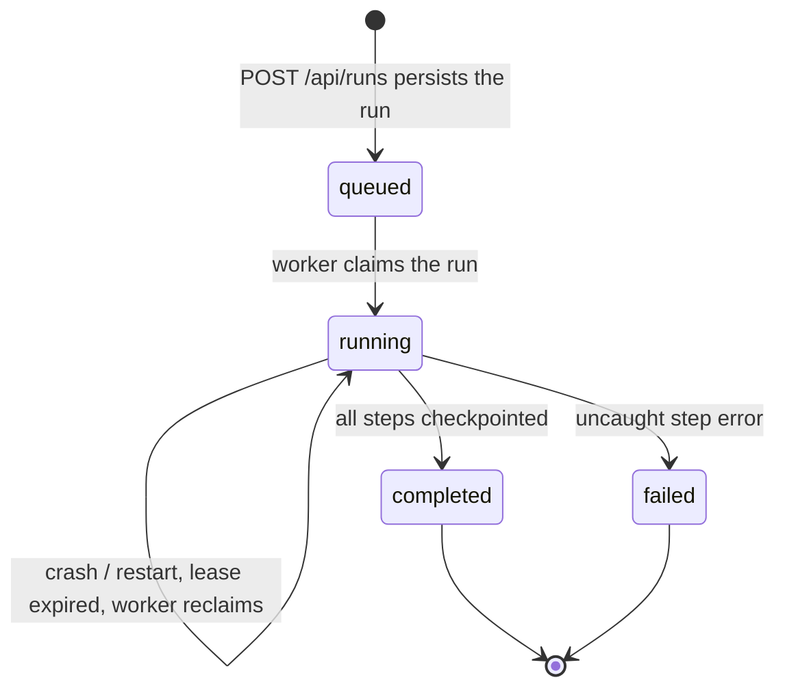

# Design

A durable run store and an in-process worker take ownership of agent execution. The browser submits work and then observes it. It is not the execution environment.

## Architecture

| Component | Responsibility | Boundary |
| --- | --- | --- |
| HTTP API | Accept runs, return snapshots, stream events. Never executes agent steps on the request path. | Request/response only. Client disconnect does not abort work. |
| Run store | Source of truth for run state, step checkpoints, leases, and the event log. Atomic file replace per run. | JSON files under `.runtime/runs/`. |
| Worker | Claims queued or abandoned runs, heartbeats a lease, executes at most two runs at a time. Started from `instrumentation.ts` when the Node server boots. | In-process. Single Next.js Node runtime. |
| Agent | Runs the five simulated steps from the first incomplete checkpoint. | Reads/writes the store; calls the fake external system only for step 4. |
| Fake external system | Persists documents. Treats `run:<id>:step:4:create-document` as an idempotency key. | Separate JSON file so its durability is independent of run records. |

The original browser connection is not part of the execution path. `POST /api/runs` writes a queued run, notifies the worker, and returns `202` with the run id. Progress is read back with `GET /api/runs/:id` and `GET /api/runs/:id/events`.

## Run lifecycle

Step records are independent of the run status:

- `pending` → `running` → `completed`
- A crash during `running` leaves the step incomplete. Recovery increments `attempt` and starts that step again.

Events are append-only: `run.accepted`, `run.started`, `run.recovered`, `step.started`, `step.completed`, `run.completed`, `run.failed`.

## Persistence and recovery

Persisted on every transition, before the next step begins:

- Run metadata (`status`, timestamps, error, result, `recoveryCount`)
- Per-step checkpoint (`status`, `attempt`, detail)
- The event that describes the transition
- Lease `{ ownerId, pid, heartbeatAt }`

Writes use temp-file + rename so a crash cannot leave a half-written run file.

Interrupted work is detected when a non-terminal run has no live lease:

- The leasing process pid is dead, or
- The last heartbeat is older than `AGENT_LEASE_TTL_MS` (default 8s)

On server start the worker claims those runs. Recovery **resumes from the first step that is not `completed`**. Completed steps are not repeated. The in-progress step is retried.

This is checkpoint-and-retry, not “restart the whole run” and not “resume a model token stream.” It is the right grain for this prototype: steps are the unit of work, and one of them has an external side effect.

## Delivery guarantees and side effects

| Event | Guarantee in the prototype |
| --- | --- |
| Accepting a run | If `POST` returns `202`, the run is on disk. A crash before the response can make the client retry and create a second run. |
| Steps 1, 2, 3, 5 | At-least-once. They have no external side effects, so retry is safe. |
| Step 4 document create | At-least-once execution, **effectively exactly-once** via idempotency key. |
| Event stream | At-least-once to the browser. Clients deduplicate by event `id`. |

The failure window called out in the starter is handled:

1. Step 4 calls `createDocument`.
2. The fake external system records the document under an idempotency key.
3. Only then is `step.completed` checkpointed.

If the process dies between (2) and (3), recovery retries step 4, `createDocument` returns the existing document, and the checkpoint is written. Blind replay does not create a second document.

If the process dies during (2) before the atomic rename, no document exists and the retry creates it once.

## Client updates

1. `POST /api/runs` returns the run id immediately. The id is stored in `localStorage`.
2. `GET /api/runs/:id` reconstructs the full snapshot after refresh.
3. `GET /api/runs` lists recent runs so a restarted browser can attach without local storage.
4. `GET /api/runs/:id/events` is an SSE stream: replay persisted events, then tail new ones. `Last-Event-ID` is honored. The handler also polls the store, so live updates still work if the worker and the route handler do not share an in-memory bus.

Closing the tab only closes the SSE stream. The worker keeps running.

## Tradeoffs and production evolution

**Shortcuts taken here**

- Worker lives in the Next.js Node process. That matches the provided crash control (`process.exit` of the app process) and keeps `pnpm dev` as the only start command.
- File-backed JSON rather than Postgres. Sufficient for a single node and easy to inspect during review.
- In-process mutex plus pid/heartbeat leases, not a distributed lock manager.
- Sequential-ish execution (max two concurrent runs).
- No authentication, no multi-tenant isolation, no durable queue product.

**What I would change before production**

- Split the worker into its own process (or several) consuming a real queue (Postgres `SKIP LOCKED`, SQS, or NATS). The API should only append work.
- Store runs in Postgres: transactional claim, `FOR UPDATE SKIP LOCKED`, and an event table.
- Outbox + idempotent consumers for every external tool call, with a dead-letter path.
- Explicit lease fencing tokens so a stolen lock cannot checkpoint after a new owner has taken over.
- Structured logs/metrics: time in queue, recovery count, duplicate-suppressed tool calls.
- Do not expose `/api/debug/crash` outside local development (already gated on `NODE_ENV`).

**Alternatives considered**

- Keep SSE on `POST /api/runs` and also persist: still ties “start” to a long request and is easy to get wrong with abort signals. Rejected.
- Restart the whole run on recovery: simpler, but duplicates step 4 without extra machinery. Checkpoint-and-retry is a small amount of code and teaches the real constraint.
- Exactly-once execution: not achievable across an external system we do not control. Exactly-once *effect* via idempotency is the honest target.

## Implemented versus proposed

| Behavior | Prototype | Production proposal only |
| --- | --- | --- |
| Execution continues after the browser disconnects or refreshes | Yes | — |
| Inspect current and past runs after reconnect | Yes | — |
| Recover after `process.exit` / `Ctrl+C` / deploy restart | Yes, resume from last completed step | Same idea, multi-node leases |
| Idempotent external document create | Yes | Outbox + per-tool idempotency keys |
| Clear completed / failed / recovered states | Yes | — |
| Multi-instance workers, no stolen-lock races | No | Fencing tokens, `SKIP LOCKED` |
| Cluster scheduling, autoscaling, auth | No | Separate worker pool and API |
