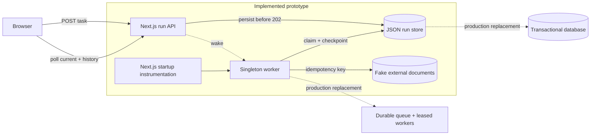
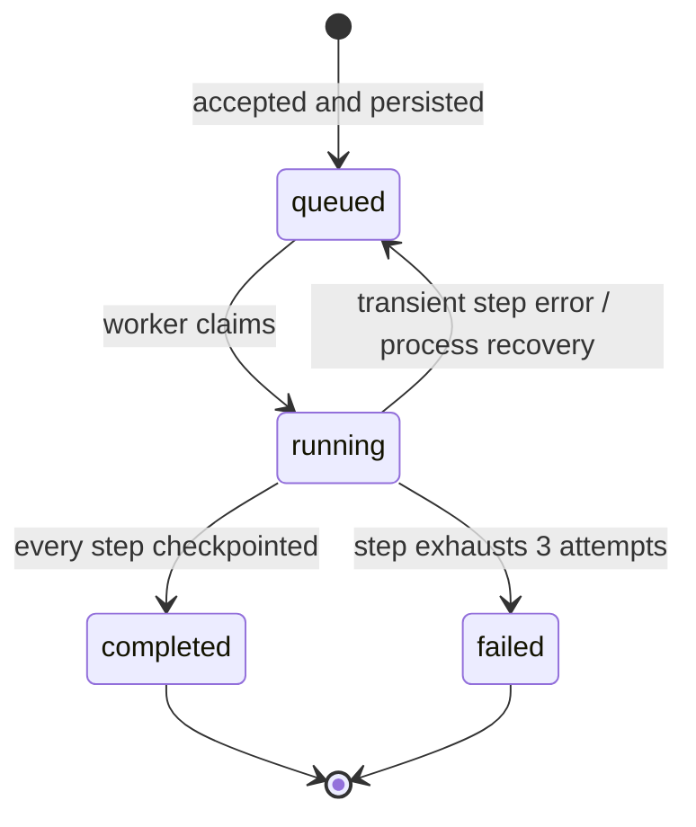

# Design: durable local agent runs

## Architecture

The prototype separates accepting work, executing it, and observing it:

- The **run API** validates a prompt, writes a queued run to the durable store, and only then returns `202 Accepted`. `GET /api/runs` and `GET /api/runs/:id` read saved state.
- The **run store** owns run, step, and event transitions. It serializes in-process access and atomically replaces `.runtime/agent-runs.json` after every transition.
- A **singleton worker** is started by Next.js instrumentation and also woken by API traffic. It claims queued runs, executes one step at a time, and checkpoints each completion. It does not use an HTTP request or browser abort signal.
- The **fake external system** persists documents separately. Step 4 sends the stable idempotency key `agent-run:<run-id>:step:4`, so replay returns the original document.
- The **browser** receives an accepted run immediately and polls snapshots. It can reconstruct all progress from persisted events after any refresh.

The solid components are implemented. The database, durable queue, and distributed workers are proposed production replacements.

## Run lifecycle

A run is `queued`, `running`, `completed`, or `failed`. Each of its five steps is `pending`, `running`, `completed`, or `failed`.

The worker skips completed steps. A transient exception resets the current step to `pending` and requeues the run, up to `AGENT_MAX_STEP_ATTEMPTS` (default 3). Exhaustion records both `step.failed` and `run.failed`. Terminal runs are never claimed again.

## Persistence and recovery

Acceptance, claims, step starts, step completions, retries, recovery, and terminal results are persisted. Every event has a per-run sequence number. Writes use a same-directory temporary file and atomic rename, while a process-local mutex prevents lost updates inside one server process.

At backend startup, `instrumentation.ts` initializes the worker. Any run left `running` belonged to the interrupted process: its running step becomes `pending`, the run becomes `queued`, and a `run.recovered` event explains the decision. The next claim increments the execution attempt and resumes from the first incomplete step. A second initialization path in the APIs makes recovery robust in development environments that reload modules.

This is **step-level at-least-once execution**. Work before the last completed checkpoint can repeat; completed steps do not. A crash immediately after the final step checkpoint but before the run completion record causes only the final run transition to be replayed.

## Delivery guarantees and side effects

The prototype guarantees:

- A returned `202` refers to a run already present in the run store.
- Browser disconnects cannot cancel execution.
- Process interruption cannot remove accepted or checkpointed state.
- On restart, interrupted runs are automatically discoverable and requeued.
- Run and step failures, retries, recovery, and completion are explicit and queryable.

It does not guarantee survival of disk loss or power loss (files are not `fsync`ed), and it supports only one backend process writing the files. A process can stop after an external document is created but before step completion is recorded. The retry repeats the call with the same idempotency key, so the fake service returns the original document rather than creating a duplicate. This demonstrates an idempotent consumer contract; it is not an atomic transaction across the two stores.

Events cannot be observed out of order within one snapshot because store mutations are serialized. Polling may skip intermediate screen renders, but the next snapshot includes the complete event history.

## Client updates

`POST /api/runs` returns the durable run snapshot and a `Location` header. The client polls the run collection, selected run, and external documents every second. A refresh first loads run history, selects the newest run, and rebuilds its timeline from saved events. Polling was selected over SSE for the prototype because correctness comes from snapshots, not a long-lived connection. Production can add SSE or WebSockets as a notification optimization while retaining snapshot/replay endpoints as the source of truth.

## Tradeoffs and production evolution

The file store makes the crash behavior transparent and keeps local setup to `pnpm dev`, but atomic rename plus a process mutex is not safe for multiple instances. It also rewrites the full run collection and has no retention policy.

Before production:

1. Put runs, steps, and append-only events in a transactional database with optimistic transition guards.
2. Publish accepted run IDs to a durable queue transactionally (outbox pattern), then use visibility timeouts or expiring leases and heartbeats to detect dead workers.
3. Let many workers claim jobs with compare-and-swap semantics. Add bounded exponential backoff, retry classifications, dead-letter handling, cancellation, and operator-driven retry.
4. Require idempotency keys for every side effect and store provider responses. Where providers cannot deduplicate, use reconciliation or an intent/outbox record and expose the remaining ambiguity.
5. Add authenticated tenant-scoped APIs, pagination/retention, metrics for queue age and retries, structured logs with run IDs, and alerts for stale leases.
6. Stream event notifications to clients, while reconnects continue to use sequence cursors and durable snapshots.

## Implemented versus proposed

Implemented and tested: durable-before-response acceptance, persisted state/events, browser-independent execution, startup recovery from the last step checkpoint, bounded step retries, explicit terminal states, refreshable run history, and idempotent replay of the fake external action.

Proposed only: multi-instance coordination, database/queue durability, lease heartbeats, transactional outbox delivery, cross-host failover, authentication, cancellation, operational controls, and push-based client updates.
