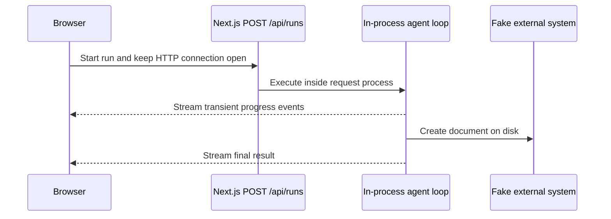

# Starter architecture

The starter intentionally couples the agent lifecycle to a single HTTP request and client connection.

Run progress is sent through the active response stream. The simulated external system stores created documents in `.runtime/fake-external-actions.json` so they remain available when the application is started again.

The starter does not prescribe how it should be changed. The assignment is to investigate its behavior under the supplied scenarios, choose an approach, and explain the decisions made.
