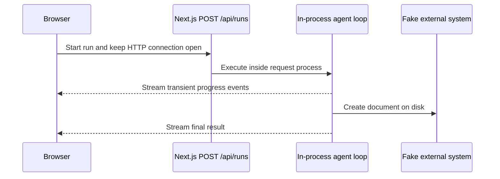

# Starter architecture

The starter intentionally couples the agent lifecycle to a single HTTP request and client connection.

There is no persistent record of a run, its state, or its events. The generated run ID exists only in the active stream. The external action is deliberately different: created documents are stored in `.runtime/fake-external-actions.json` and survive application restarts.

This asymmetry exposes an important failure window. An external action may succeed even though the agent process stops before the run records or reports that success. Blindly repeating the work can therefore create another document.

The starter does not prescribe how to solve these problems. The assignment is to choose an execution model, implement its critical path, and explain its guarantees.
